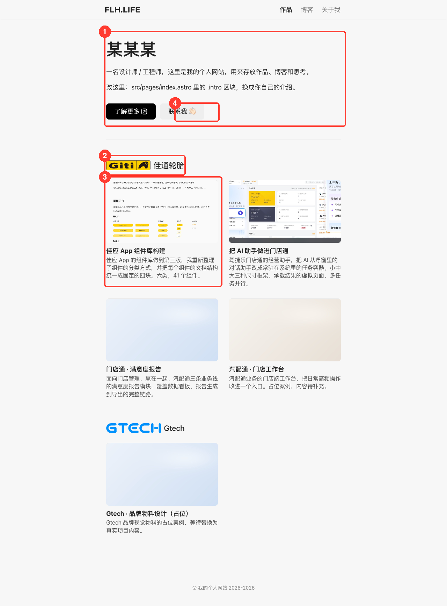
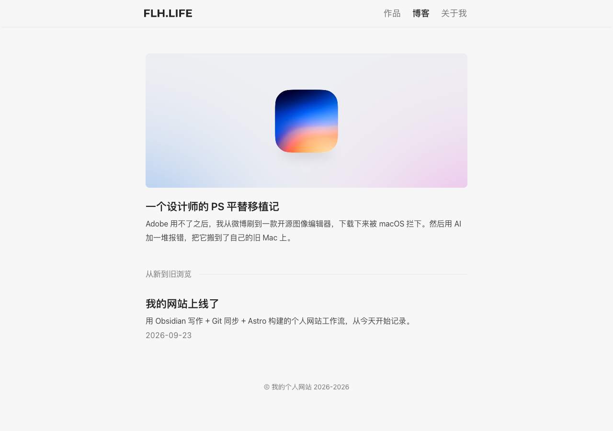
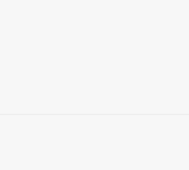
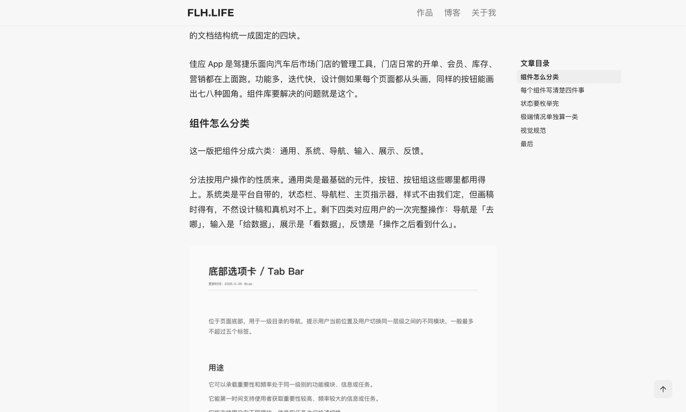
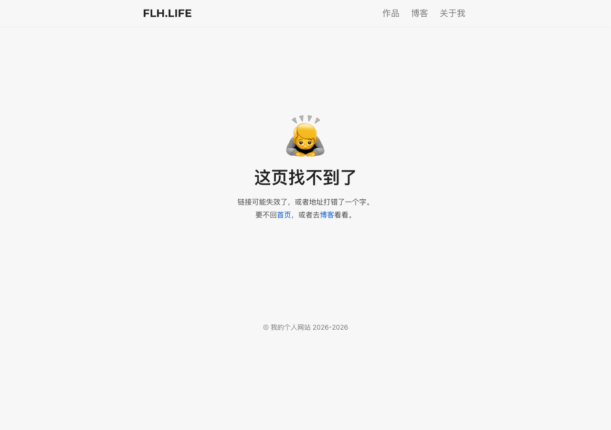
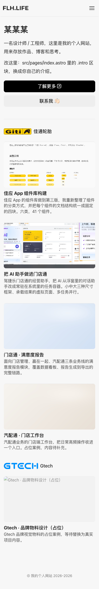

# my-site 网站操作指南

> 线上地址：https://zhangqier94-my-site.pages.dev
> 仓库：https://github.com/zhangqier94-cyber/my-site
> 写作工具：Obsidian（仓库根目录就是 vault）
> 本指南放在仓库里，跟着 git 走，换电脑也能看到。截图都是当前网站的真实样子。

---

## 0. 一分钟理解这套系统

```
Obsidian 打开 ~/Documents/my-site（仓库根目录就是 vault）
        ↓ 改 .md、放图片
site-publish（任意目录敲这条命令，或手动 git push origin main）
        ↓
GitHub 仓库更新
        ↓
Cloudflare Pages 自动拉代码 → npm run build → 部署
        ↓
约 1-2 分钟后 https://zhangqier94-my-site.pages.dev 更新
```

**核心认知：构建和部署全自动，你只管写内容。** 网站上的一切都对应仓库里的某个文件——改文件 = 改网站。

---

## 1. 日常发布：改完怎么上线

打开**新开**的终端窗口（让 `~/.profile` 里的 PATH 生效），任意目录敲：

```bash
site-publish
```

实际交互长这样：

```
$ site-publish
→ 待发布的改动：
M src/content/blog/xxx.md
?? src/content/blog/new-post.md
---
commit message [回车用默认: update: 2026-10-08 16:20]:
✓ 已推送 → Cloudflare Pages 自动构建部署（约 1-2 分钟）
→ 部署状态：Cloudflare 后台 → Workers 和 Pages → zhangqier94-my-site → Deployments
```

回车用默认 commit message，或输入一句描述。

**看部署进度：** 登录 https://dash.cloudflare.com → 左侧 **Workers 和 Pages** → 点 **zhangqier94-my-site** → **Deployments** 标签。绿色的 Success = 上线了；失败的点进去看构建日志。

**本地预览（不发布）：** 想先看看效果再发，在终端里：

```bash
cd ~/Documents/my-site && npm run dev
```

然后浏览器开 http://localhost:4321 ，边改边刷新。Ctrl+C 退出。这只在本地跑，不影响线上。

---

## 2. 模块地图：页面上每样东西对应哪个文件

首页整页长这样，红框标出了四个可编辑区：



| ① 区块 | 改哪里 | 说明 |
|---|---|---|
| 自我介绍区 | `src/pages/index.astro` 开头的 `<div class="intro">` | 姓名、介绍、两个按钮 |
| 公司分组（logo + 名称 + 时间） | `src/data/companies.ts` | 加公司、换 logo、调顺序 |
| 作品卡片（封面 + 标题 + 描述） | `src/content/projects/*.md` 的 frontmatter | 每个作品一个 .md 文件 |
| 「联系我」弹卡 | `src/data/contact.ts` | 二维码图、手机号、邮箱 |

其他模块：

| 页面位置 | 改哪里 |
|---|---|
| 导航栏「作品 / 博客 / 关于我」 | `src/layouts/Base.astro` 里的 `navItems` |
| 左上角 FLH.LIFE logo | `public/css/main.css` 里 `.box-logo` 的背景（模板自带的 SVG，见 §8） |
| 关于我页面 | `src/pages/about.astro` |
| 浏览器标签图标 favicon | `public/img/favicon/` 整套图 |
| 404 页 | `src/pages/404.astro` |
| 网站名（页面标题、页脚版权） | `src/layouts/Base.astro` 里的 `siteName` |

---

## 3. 写博客（最常用）

### 新建一篇

在 Obsidian 文件列表进入 `src/content/blog/`，新建 `xxx.md`（文件名用英文和连字符，它就是网址的一部分）：

```markdown
---
title: 文章标题
description: 一两句话摘要，会显示在列表和分享卡片上
pubDate: 2026-10-08
tags: [标签1, 标签2]
heroImage: /img/blog/xxx.jpg   ← 可选，见下方说明
---

## 第一个章节
正文……

## 第二个章节
……
```

保存后 `site-publish` 即上线，网址是 `https://zhangqier94-my-site.pages.dev/blog/xxx/`。

### 关于封面图（heroImage）

博客列表页里**最新的一篇**会占头图位（下面截图里的摩托大图就是 heroImage），其余文章是纯文字行。所以：

- heroImage 只对**最新一篇**可见，文章详情页里**不显示**封面
- 图放 `public/img/blog/`，frontmatter 里写 `/img/blog/xxx.jpg`（以 `/img/` 开头的绝对路径）
- 推荐尺寸：约 765×574（4:3），jpg 即可



### 文章内插图

图片放 `public/img/blog/`，正文里写 ``。

建议 Obsidian 设置 → 文件与链接 → 附件默认存放路径设为 `public/img/blog`，粘贴截图自动归位。文件名用英文 + 连字符，别用中文和空格。

### 章节与右侧目录

文章里写了 `##` 和 `###` 标题，详情页右侧会自动生成可点击的目录，滚动时高亮当前章节：



全文没有 `##` 标题的文章（纯散文）不会显示目录，这是正常的。

### 改 / 删 / 藏

- **改**：直接在 Obsidian 里编辑保存，`site-publish`
- **删**：在 Obsidian 里删掉 .md 文件，`site-publish`（线上网址会变 404）
- **暂时隐藏**：frontmatter 加一行 `draft: true`，构建时直接跳过，文件留着

---

## 4. 作品与公司分组

### 新增一个作品

首页上一个公司分组模块长这样（logo + 公司名 + 该公司所有作品卡片）：


在 `src/content/projects/` 新建 `xxx.md`：

```markdown
---
title: 项目名称
description: 卡片上显示的一两句介绍
company: giti        ← 必填！对应 companies.ts 里的 id，决定归到哪个公司组
cover: /img/works/xxx.jpg   ← 卡片封面图，放 public/img/works/
order: 3             ← 同一组内的排序，数字小的在前
tags: [Swift, macOS]
role: 设计 + 开发     ← 可选，详情页头部信息
year: 2026           ← 可选
link: https://...    ← 可选，演示链接
---

## 项目背景
正文……
```

封面放 `public/img/works/`，推荐 1600×900（16:9）。

**⚠️ company 写错或漏写时不会报错，但作品会直接从首页消失**（因为按公司过滤）。写之前对照 `src/data/companies.ts` 里的 id。

作品详情页长这样（有章节同样会出右侧目录）：



### 新增一家公司（三步）

1. `src/data/companies.ts` 里加一行：

```ts
{ id: 'newco', name: '新公司名', icon: '/img/company/newco.svg', period: '2025 - 至今', order: 3 },
```

2. logo 放 `public/img/company/newco.svg`（svg 或 png 都行，横向 logo 效果最好，高约 40px 显示）
3. 作品的 frontmatter 写 `company: newco`

没有作品的新公司**不会显示**在首页（空分组自动隐藏），先给这家公司建一个作品。

### 调整公司顺序

改 `companies.ts` 里的 `order` 数字（小的在前），当前是佳通轮胎 1、Gtech 2。

---

## 5. 「联系我」弹卡

首页自我介绍区点「联系我」弹出的卡片（二维码 + 复制手机号 / 邮箱）全部由 **一个文件** 控制：


改 `src/data/contact.ts`：

```ts
export const contact = {
  wechatQr: '/img/contact/wechat-qr.png',  // 换二维码就覆盖这个文件
  phone: '138-0000-0000',                  // ← 目前是占位，改成真实手机号
  email: 'hello@example.com',              // ← 目前是占位，改成真实邮箱
};
```

换微信二维码：直接用新图覆盖 `public/img/contact/wechat-qr.png`（正方形，600×600 左右最好）。

---

## 6. 图片管理总表

| 用途 | 放哪个目录 | 正文里怎么引用 | 推荐尺寸 |
|---|---|---|---|
| 博客头图 | `public/img/blog/` | `/img/blog/xxx.jpg` | 765×574 |
| 博客内文插图 | `public/img/blog/` | `/img/blog/xxx.jpg` | 宽 ≤1600 |
| 作品封面 | `public/img/works/` | frontmatter 里 `/img/works/xxx.jpg` | 1600×900 |
| 公司 logo | `public/img/company/` | `companies.ts` 里引用 | 高 ~40px，svg 佳 |
| 微信二维码 | `public/img/contact/` | `contact.ts` 里引用 | 600×600 正方形 |
| 浏览器图标 | `public/img/favicon/` | 无需引用（自动） | 全套已配好 |

通用规则：

- 文件名**英文 + 连字符**，如 `compositor-cover.jpg`；中文/空格名容易出缓存问题
- 引用路径以 `/img/` **开头**（它是相对网站根目录的，不是相对 md 文件的）
- 图片太大就先压一下（导出 jpg 质量 80 左右），首页加载快很多

---

## 7. 部署、回滚与双机协作

### 发布链路

push 到 `main` 分支 → Cloudflare Pages 自动构建部署。**不需要任何手动部署动作。**

### 版本回滚

线上出问题想退回上一版，两种办法：

**方法一（最快，点按钮）**：Cloudflare 后台 → Workers 和 Pages → zhangqier94-my-site → **Deployments** → 找到上一个成功的部署 → 菜单里 **Rollback to this deployment**。秒级生效，不影响代码。

**方法二（规范，改代码）**：

```bash
cd ~/Documents/my-site
git log --oneline -5     # 找到要退回的 commit
git revert HEAD          # 生成一个反向提交
site-publish
```

### 家里电脑发文

完整步骤在仓库根目录的 `README.md`「🖥 换机 / 新电脑部署」一节，clone 下来就能看到。核心规矩一句话：**开工先 `git pull`，收工必 `site-publish`**——两台机器交替改同一个文件而不 pull，push 会被拒。

---

## 8. 当前还挂着的占位（待你替换）

以下位置还是模板占位内容，改完记得 `site-publish`：

| 位置 | 文件 | 现状 |
|---|---|---|
| 首页大标题 | `src/pages/index.astro` 第 20 行 | 「某某某」+ 模板介绍 |
| 文章页作者名 | `src/layouts/BlogPost.astro` 第 18 行 `const author = '某某某'` | 每篇文章作者栏 |
| 弹卡手机号 / 邮箱 | `src/data/contact.ts` | 假号码、假邮箱 |
| 关于页邮箱 / GitHub | `src/pages/about.astro` | your@email.com 等占位 |
| 网站名 | `src/layouts/Base.astro` 的 `siteName` | 「我的个人网站」（页面标题和页脚） |
| 导航 logo | `public/css/main.css` 的 `.box-logo` | 「FLH.LIFE」是模板自带的 SVG（内嵌在 CSS 里）。要换成自己的字标，最省事的办法：做一个同尺寸 svg/png，把 `.box-logo` 的 background 改成 `url('/img/xxx.svg') no-repeat center/contain` |
| Gtech 占位作品 | `src/content/projects/gtech-placeholder.md` | 标注了占位，替换成真实案例 |

---

## 9. 故障排查

### 网站没更新？

按顺序查：

1. **push 了吗？** `git status` 看工作区是不是干净的。忘了敲 `site-publish` 是最常见原因——它没有兜底
2. **强刷浏览器**（⌘⇧R 或开无痕窗口）。favicon 和 css 的缓存尤其顽固
3. **部署失败了吗？** Cloudflare 后台 → Deployments，看最新一条是 Success 还是 Error。失败的点进去看日志

### push 被拒 / 要密码

- 报 `Authentication failed` 或反复要密码：GitHub 密码早就不能用于推送了，要用 **PAT**。这台 Mac 的 token 存在钥匙串（钥匙串访问 → 搜 `github.com`）。失效就重新生成一个（勾 `repo` + `workflow`），在 GitHub → Settings → Developer settings → Tokens
- 报 `non-fast-forward` / `rejected`：另一台机器（或别处）有新提交，先 `git pull --rebase` 再 `site-publish`

### 构建失败（部署列表里红色 Error）

最常见的三种：

1. **frontmatter 字段非法**：文章缺 `title`、博客缺 `pubDate`、日期格式不对（要 `2026-10-08` 这种）、`link` 不是完整网址——Astro 校验不过整站构建直接失败。看构建日志里报的文件名去改
2. **Node 版本**：Cloudflare 环境变量 `NODE_VERSION=22` 是配好的，别删
3. **图片 404 不会导致构建失败**，只会页面裂图，单独处理即可

### 图片不显示

- 引用路径忘了以 `/img/` 开头，或文件名大小写不一致（服务器区分大小写）
- 文件确实没放进对应目录（对照 §6 的表）

### 作品从首页消失了

九成是 `company` 字段写错（对不上 `companies.ts` 的 id）或漏写。空分组也是直接隐藏的，所以一家公司的所有作品 company 都错时，整个组都不见了。

### 文章页 404

frontmatter 非法导致该篇没构建出来。看 Cloudflare 构建日志里报的文件名，修好字段再发。

### 双机冲突

家里改了 A 文件没 push，公司又改了 A 文件并 push 成功——家里再 push 就被拒。`git pull --rebase` 解决；真冲突了会标出文件，手动合并后重新提交。

---

## 10. 命令速查

```bash
site-publish                 # 发布（任意目录，新开终端窗口）
cd ~/Documents/my-site
npm run dev                  # 本地预览 http://localhost:4321
npm run build                # 本地完整构建一遍（验证有没有构建错误）
npm run preview              # 预览"构建产物"（和线上完全一致的版本）
git status --short           # 看当前改了哪些文件
git log --oneline -5         # 看最近 5 次提交
git revert HEAD              # 撤销最近一次提交
git pull --rebase            # 同步远程（双机换手时先跑这个）
```

> 换新电脑的完整步骤见仓库根目录 `README.md`。

---

## 附：其他页面长这样

**404 页**（访问不存在的网址时出现；如果你看到了它，多半是链接写错了）：



**手机端首页**（响应式，无需单独维护）：


